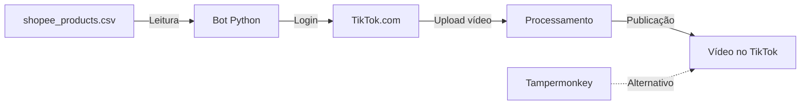

# 🎵 TikTok Post - Bot de Automação TikTok

## O que é?
Conjunto de ferramentas para automatizar a postagem de produtos em vídeos no TikTok e Reels, incluindo:
- Bot Python para automação
- Script Tampermonkey para browser
- Integração com dados do Shopee

## Componentes

### 1. tiktok_bot_fiel_completo.py - Bot Python

Bot completo em Python que automatiza a postagem em TikTok.

#### Pré-requisitos
```bash
# Instalar Python 3.8+
python --version

# Instalar dependências
pip install selenium pyautogui pillow

# Download WebDriver para Chrome
# https://chromedriver.chromium.org
```

#### Como usar

```bash
# 1. Navegar até a pasta
cd /home/alessandro/bin/Git_Repo/BestPriceToday/tools/tiktok_post

# 2. Configurar dados
# Edite o arquivo para adicionar:
# - Credenciais do TikTok
# - Links dos vídeos
# - Hashtags e descrições

# 3. Executar bot
python tiktok_bot_fiel_completo.py
```

#### Funcionalidades
- ✅ Login automático no TikTok
- ✅ Upload de vídeos
- ✅ Adiciona descrição e hashtags
- ✅ Define privacidade (público/privado)
- ✅ Agenda postagens
- ✅ Gerencia múltiplas contas
- ✅ Retry automático em caso de erro

### 2. tiktok_post.user.js - Tampermonkey Script

Script para automação via navegador (melhor para debugging).

#### Como usar

1. **Instalar Tampermonkey**
   - Chrome: https://chrome.google.com/webstore/detail/tampermonkey
   - Firefox: https://addons.mozilla.org/firefox/addon/tampermonkey

2. **Instalar script**
   - Abra `tiktok_post.user.js` no editor
   - Copie todo o conteúdo
   - Crie novo script no Tampermonkey
   - Cole o código

3. **Configurar**
   - Edite as variáveis no início do script
   - Configure tags, categorias, descrição

4. **Usar**
   - Vá para https://www.tiktok.com
   - O script adiciona botões auxiliares
   - Use os botões para automatizar

### 3. tiktop_post.py - Versão Alternativa

Script Python alternativo com diferentes abordagens.

#### Como usar
```bash
python tiktop_post.py
```

## Fluxo de Trabalho



## Configuração

### Credenciais
```python
# No código, configure:
TIKTOK_USERNAME = "seu_usuario"
TIKTOK_PASSWORD = "sua_senha"
HASHTAGS = ["#trending", "#shopping", "#produtos"]
DESCRICAO = "Confira os melhores produtos! 🛍️"
```

### Dados de entrada (Do Shopee Extract)
O bot usa automaticamente:
- `shopee_products.csv` - Informações dos produtos
- `shopee_videos.csv` - Dados para legendas
- `videos/` - Vídeos MP4 processados

### Agendamento
```python
# Configurar horários de postagem
SCHEDULE = [
    {"time": "09:00", "video": "products_001.mp4"},
    {"time": "14:00", "video": "products_002.mp4"},
    {"time": "18:00", "video": "products_003.mp4"},
]
```

## Arquivos

| Arquivo | Descrição |
|---------|-----------|
| `tiktok_bot_fiel_completo.py` | Bot Python completo |
| `tiktok_post.user.js` | Script Tampermonkey |
| `tiktop_post.py` | Versão alternativa Python |

## Exemplo de Execução

```bash
# 1. Extrair produtos do Shopee
cd ../shopee_extract_mp4
# ... execute console_script.js ...

# 2. Gerar vídeos
python tiktok_bot_fiel_completo.py --generate-videos

# 3. Postar no TikTok
python tiktok_bot_fiel_completo.py --post --schedule

# Ver status
python tiktok_bot_fiel_completo.py --status
```

## Recursos Avançados

### Múltiplas contas
```python
CONTAS = [
    {"user": "conta1", "pass": "senha1"},
    {"user": "conta2", "pass": "senha2"},
]
# Bot distribui vídeos entre contas
```

### Filtros de produtos
```python
FILTROS = {
    "preco_min": 10,
    "preco_max": 500,
    "avaliacao_min": 4.0,
    "vendidos_min": 1000,
}
```

### Geração de legendas
```python
LEGENDAS = {
    "template": "Esse produto é INCRÍVEL! 🔥 Link na bio",
    "incluir_preco": True,
    "incluir_desconto": True,
}
```

## Dicas

- ✅ Use contas de teste primeiro
- ✅ Respeite o rate limit do TikTok (máx 10 posts/hora)
- ✅ Varie os horários de postagem
- ✅ Monitore os vídeos para engajamento
- ⚠️ Leia os termos de uso do TikTok
- ⚠️ Não use bots excessivamente (pode resultar em ban)
- ⚠️ Mantenha conteúdo de qualidade

## Troubleshooting

| Problema | Solução |
|----------|--------|
| "Login failed" | Verifique credenciais, ative 2FA se necessário |
| "Video upload error" | Verifique formato MP4 e tamanho (<280MB) |
| "Rate limit exceeded" | Aguarde 1 hora antes de novos posts |
| Script não encontra elementos | TikTok atualizou interface, edite seletores CSS |
| Chrome não abre | Instale ChromeDriver da versão do seu Chrome |

## Integração com Shopee Extract

```bash
# Fluxo completo
cd ../shopee_extract_mp4
# ... extrair produtos ...
cp shopee_*.csv ../tiktok_post/

# Voltar para tiktok_post
cd ../tiktok_post
python tiktok_bot_fiel_completo.py --auto-process
```

## Monitoramento

O bot gera logs em:
- `logs/tiktok_bot.log` - Histórico de execução
- `logs/errors.log` - Erros e problemas
- `stats.json` - Estatísticas de postagem

## Próximos passos

1. Configure as credenciais
2. Teste com um vídeo
3. Configure agendamento
4. Monitore engajamento
5. Ajuste legendas e hashtags conforme necessário
